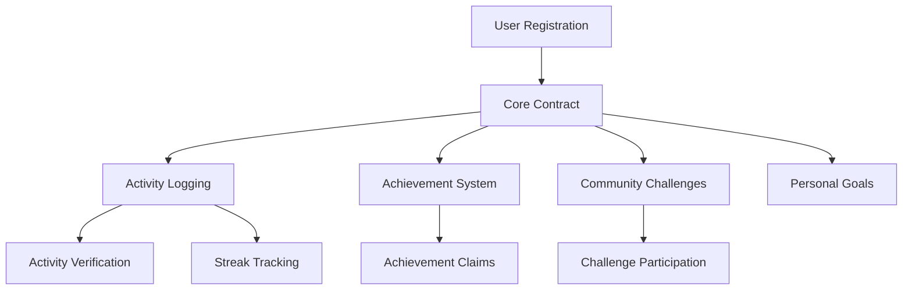

# ZenTide Wellness Platform

A blockchain-based wellness platform that incentivizes consistent meditation, yoga, and affirmation practices through achievement tokens and community recognition.

## Overview

ZenTide is a decentralized platform that helps users maintain consistent wellness practices by:
- Tracking and validating wellness activities
- Rewarding consistent participation
- Creating personal wellness goals
- Facilitating community challenges
- Issuing achievement tokens
- Building a supportive wellness community

## Architecture

The platform is built around a core smart contract that manages user activities, achievements, and community interactions.



### Core Components
- User Management
- Activity Tracking
- Achievement System
- Streak Tracking
- Community Challenges
- Personal Goals
- Verification System

## Contract Documentation

### zentide-core.clar

The main contract handling all platform functionality.

#### Key Features
- User registration and profile management
- Activity logging and verification
- Achievement tracking and rewards
- Streak monitoring
- Community challenge management
- Personal goal setting

#### Access Control
- `admin`: Controls platform configuration and challenge creation
- `verifier`: Validates user activities
- Users: Can register, log activities, and participate in challenges

## Getting Started

### Prerequisites
- Clarinet
- Stacks wallet
- Node.js environment

### Installation
1. Clone the repository
2. Install dependencies
```bash
clarinet install
```

### Basic Usage
```clarity
;; Register as a user
(contract-call? .zentide-core register-user "username")

;; Log a meditation session
(contract-call? .zentide-core log-activity "meditation" u30 (some u"Morning session"))

;; Join a community challenge
(contract-call? .zentide-core join-challenge u1)
```

## Function Reference

### User Management
```clarity
(register-user (username (string-utf8 50)))
(get-user-profile (user principal))
```

### Activity Logging
```clarity
(log-activity (activity-type (string-utf8 20)) 
             (duration-minutes uint)
             (notes (optional (string-utf8 200))))
```

### Achievement System
```clarity
(claim-achievement-reward (achievement-id (string-utf8 50)))
(get-user-achievements (user principal))
```

### Community Features
```clarity
(join-challenge (challenge-id uint))
(set-personal-goal (activity-type (string-utf8 20)) 
                  (target-count uint) 
                  (target-duration uint)
                  (end-date uint))
```

## Development

### Testing
Run the test suite:
```bash
clarinet test
```

### Local Development
1. Start Clarinet console:
```bash
clarinet console
```
2. Deploy contracts:
```clarity
(contract-call? .zentide-core initialize)
```

## Security Considerations

### Data Validation
- All user inputs are validated before processing
- Duration and timestamp checks prevent invalid entries
- Activity verification system ensures authenticity

### Access Controls
- Admin-only functions for platform configuration
- Verified activity logging
- Protected achievement claims

### Limitations
- Activities require verifier approval
- Achievements can only be claimed once
- Challenge participation has time constraints

Remember to:
- Never share private keys
- Verify all transaction details
- Monitor activity verifications
- Review challenge parameters before joining